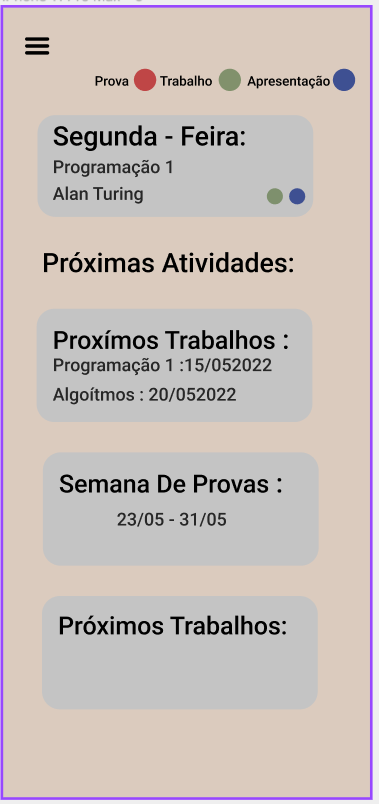
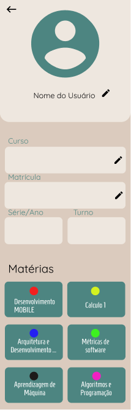

Projeto em andamento:  *Inicio prototypação*
<<<<<<< HEAD

ATUALIZANDO: 
CORES:
 	*Fundo: #6b256f *
   
  *Secundaria: #ffffff*
   
  *Textos: #5e5e5e*
   
FONTES:
 
 

=======
Link do mokup no Figma: https://www.figma.com/proto/qihlaw2BpyYYqbvh8kBGj3/Prototipe-ADS?node-id=253%3A251&scaling=scale-down&page-id=0%3A1&starting-point-node-id=253%3A251&show-proto-sidebar=1

- demonstração das primeiras telas criadas.

 
 

*DEMONSTRAÇÃO DA VERSÃO FINAL*
--

=======
- demonstração da tela de "Home".
  
  

  
  

- demonstração da tela de "perfil".
  
  

  
  

